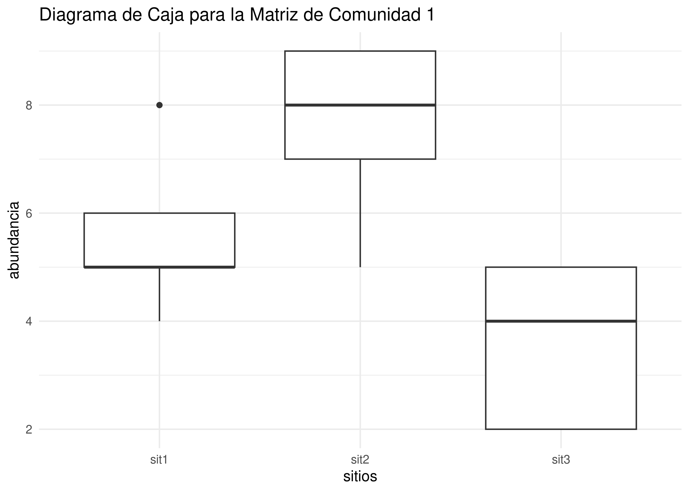

Prácticas de aula (PA04): Análisis Exploratorio de Datos (AED) y
Paradoja de Orlócy<small><br>Biogeografía (GEO-131)<br>Universidad
Autónoma de Santo Domingo (UASD)<br>Semestre 2024-02</small>
================
El Tali
2024-09-10

Versión HTML (quizá más legible),
[aquí](https://biogeografia-master.github.io/aed-transformaciones-orlocy/README.html)

Paquetes

``` r
library(tidyverse)
```

# Fecha/hora de entrega

**11 de septiembre de 2024, 11:59 pm.**

# Introducción

La biogeografía estudia la distribución de especies y ecosistemas en el
espacio geográfico y a lo largo del tiempo. El análisis exploratorio de
datos (AED) permite identificar patrones en los datos biológicos,
mientras que la paradoja de Orlócy ilustra cómo las transformaciones de
datos afectan la percepción de similitud y disimilitud entre comunidades
biológicas. Esta práctica permitirá a los estudiantes explorar ambas
técnicas y comprender cómo los datos biológicos pueden ser transformados
y analizados para obtener conclusiones más significativas.

En principio, al menos para mí como profesor, me interesan dos cosas:

1.  Que identifiques la matriz de comunidad como una clase de datos
    ecológicos específica, pues es muy usada en ecología numérica.

2.  Que visibilices las dificultades inherentes de realizar análisis
    exploratorio de datos (AED) manualmente, y que a la vez comprendas
    la teoría detrás de algunos estadísticos y representaciones básicas.
    Recuerda la referencia sobre el “Cuarteto de Anscombe” y “La docena
    del Datasauro”.

3.  Que identifiques **la importancia de aplicar transformaciones a los
    datos cuando se requiera**. El desconocimiento sobre la necesidad de
    transformar los datos, comúnmente se traduce cometen en errores en
    los análisis de diversidad alpha y beta, especialmente donde
    interviene cualquier métrica de disimilitud/similitud (el denominado
    “modo Q”). Podrás encontrar más detalles en el capítulo 3 de
    @borcard_numerical_2018 (*Association Measures and Matrices*).

# Ejercicio 1: Análisis Exploratorio de Datos (AED)

## Objetivo

Calcular estadísticos descriptivos básicos de la abundancia de especies
por sitio y representar los resultados en diagramas de caja.

## Planteamiento del Problema

Utiliza una de las 20 matrices de comunidad proporcionadas, cada una con
cinco especies y tres sitios, para calcular las siguientes medidas:
media, desviación estándar, primer cuartil, tercer cuartil, rango
intercuartilar (RIC), máximo, mínimo y atípicos (usando bisagras de
Tukey).

## Datos Proporcionados

Se proporcionan 20 matrices de comunidad generadas aleatoriamente, cada
una representando la abundancia de cinco especies en tres sitios. Elige
una de las matrices.

### Matrices de Comunidad

``` r
# Generación de 20 matrices de comunidad
set.seed(123)
community_matrices <- lapply(1:20, function(i) {
  matrix(rpois(15, lambda = 5), nrow = 3, ncol = 5) %>%
    `colnames<-`(paste0("sp", 1:5)) %>%
    `rownames<-`(paste0("sit", 1:3))
})
names(community_matrices) <- paste0("Matriz de comunidad ", 1:20)
community_matrices_k <- lapply(
  community_matrices,
  function(x) {
    colnames(x) <- gsub('\\n', '', colnames(x))
    knitr::kable(x, digits = 2, align = 'c')
    })
```

``` r
# Imprimir tablas
for (tabla in 1:length(community_matrices_k)) {
  cat("\n\n\n")
  cat('Matriz de comunidad', tabla)
  print(community_matrices_k[[tabla]])
}
```

Matriz de comunidad 1

|      | sp1 | sp2 | sp3 | sp4 | sp5 |
|:-----|:---:|:---:|:---:|:---:|:---:|
| sit1 |  4  |  8  |  5  |  5  |  6  |
| sit2 |  7  |  9  |  8  |  9  |  5  |
| sit3 |  4  |  2  |  5  |  5  |  2  |

Matriz de comunidad 2

|      | sp1 | sp2 | sp3 | sp4 | sp5 |
|:-----|:---:|:---:|:---:|:---:|:---:|
| sit1 |  8  |  4  |  6  |  6  |  5  |
| sit2 |  3  |  9  |  6  |  6  |  4  |
| sit3 |  2  |  8  | 11  |  5  |  3  |

Matriz de comunidad 3

|      | sp1 | sp2 | sp3 | sp4 | sp5 |
|:-----|:---:|:---:|:---:|:---:|:---:|
| sit1 |  9  |  7  |  6  |  3  |  4  |
| sit2 |  8  |  1  |  3  |  3  |  4  |
| sit3 |  6  |  5  |  4  |  4  |  3  |

Matriz de comunidad 4

|      | sp1 | sp2 | sp3 | sp4 | sp5 |
|:-----|:---:|:---:|:---:|:---:|:---:|
| sit1 |  3  |  4  |  5  |  5  |  6  |
| sit2 |  3  |  7  |  7  |  3  |  8  |
| sit3 |  5  |  2  |  2  |  3  |  4  |

Matriz de comunidad 5

|      | sp1 | sp2 | sp3 | sp4 | sp5 |
|:-----|:---:|:---:|:---:|:---:|:---:|
| sit1 |  6  |  4  |  7  |  4  |  6  |
| sit2 |  2  |  7  |  7  |  6  |  0  |
| sit3 |  4  |  5  |  7  |  6  |  5  |

Matriz de comunidad 6

|      | sp1 | sp2 | sp3 | sp4 | sp5 |
|:-----|:---:|:---:|:---:|:---:|:---:|
| sit1 |  3  |  4  |  6  |  2  |  8  |
| sit2 |  4  |  2  |  4  |  4  |  8  |
| sit3 |  5  |  3  |  7  | 10  |  3  |

Matriz de comunidad 7

|      | sp1 | sp2 | sp3 | sp4 | sp5 |
|:-----|:---:|:---:|:---:|:---:|:---:|
| sit1 |  3  |  6  |  7  |  5  |  5  |
| sit2 |  6  |  4  |  2  |  5  |  9  |
| sit3 |  4  |  3  |  5  |  4  |  5  |

Matriz de comunidad 8

|      | sp1 | sp2 | sp3 | sp4 | sp5 |
|:-----|:---:|:---:|:---:|:---:|:---:|
| sit1 |  8  |  4  |  4  |  6  |  9  |
| sit2 |  8  |  3  |  2  |  3  |  5  |
| sit3 |  5  |  9  |  9  |  5  |  4  |

Matriz de comunidad 9

|      | sp1 | sp2 | sp3 | sp4 | sp5 |
|:-----|:---:|:---:|:---:|:---:|:---:|
| sit1 |  6  |  3  |  3  |  6  |  6  |
| sit2 |  4  |  4  |  2  |  6  |  6  |
| sit3 |  4  | 10  |  3  |  8  |  5  |

Matriz de comunidad 10

|      | sp1 | sp2 | sp3 | sp4 | sp5 |
|:-----|:---:|:---:|:---:|:---:|:---:|
| sit1 |  6  | 10  |  4  |  7  |  2  |
| sit2 |  7  |  4  |  1  |  3  |  3  |
| sit3 |  7  |  4  |  3  |  3  |  6  |

Matriz de comunidad 11

|      | sp1 | sp2 | sp3 | sp4 | sp5 |
|:-----|:---:|:---:|:---:|:---:|:---:|
| sit1 |  7  |  3  |  5  |  3  |  6  |
| sit2 |  5  |  2  |  3  |  5  |  4  |
| sit3 |  4  |  4  |  5  |  4  |  4  |

Matriz de comunidad 12

|      | sp1 | sp2 | sp3 | sp4 | sp5 |
|:-----|:---:|:---:|:---:|:---:|:---:|
| sit1 |  5  |  4  |  3  |  6  |  5  |
| sit2 |  6  |  4  |  7  |  6  |  8  |
| sit3 |  3  |  6  |  6  |  4  |  5  |

Matriz de comunidad 13

|      | sp1 | sp2 | sp3 | sp4 | sp5 |
|:-----|:---:|:---:|:---:|:---:|:---:|
| sit1 |  7  |  3  |  4  |  8  | 10  |
| sit2 |  4  |  5  |  5  |  4  |  6  |
| sit3 |  6  |  5  |  8  |  4  |  9  |

Matriz de comunidad 14

|      | sp1 | sp2 | sp3 | sp4 | sp5 |
|:-----|:---:|:---:|:---:|:---:|:---:|
| sit1 |  5  |  3  |  9  |  4  |  4  |
| sit2 |  4  |  5  |  5  |  8  |  3  |
| sit3 |  6  |  3  |  5  |  4  |  3  |

Matriz de comunidad 15

|      | sp1 | sp2 | sp3 | sp4 | sp5 |
|:-----|:---:|:---:|:---:|:---:|:---:|
| sit1 |  5  |  6  |  4  |  8  |  6  |
| sit2 |  3  |  2  |  4  |  4  |  6  |
| sit3 |  3  |  6  |  7  |  9  |  2  |

Matriz de comunidad 16

|      | sp1 | sp2 | sp3 | sp4 | sp5 |
|:-----|:---:|:---:|:---:|:---:|:---:|
| sit1 |  4  |  6  |  4  |  3  |  7  |
| sit2 |  5  |  8  |  5  |  4  |  3  |
| sit3 |  5  |  6  |  2  |  3  |  7  |

Matriz de comunidad 17

|      | sp1 | sp2 | sp3 | sp4 | sp5 |
|:-----|:---:|:---:|:---:|:---:|:---:|
| sit1 |  5  |  6  |  4  |  6  |  5  |
| sit2 |  6  |  4  | 10  |  3  |  4  |
| sit3 |  3  |  6  |  9  |  3  |  5  |

Matriz de comunidad 18

|      | sp1 | sp2 | sp3 | sp4 | sp5 |
|:-----|:---:|:---:|:---:|:---:|:---:|
| sit1 |  7  |  5  |  8  |  5  |  4  |
| sit2 |  3  |  8  |  6  |  5  |  1  |
| sit3 |  4  |  8  |  9  |  4  |  5  |

Matriz de comunidad 19

|      | sp1 | sp2 | sp3 | sp4 | sp5 |
|:-----|:---:|:---:|:---:|:---:|:---:|
| sit1 |  8  |  3  | 10  |  6  |  4  |
| sit2 |  0  |  7  |  5  |  6  |  3  |
| sit3 |  2  |  6  |  2  |  3  |  2  |

Matriz de comunidad 20

|      | sp1 | sp2 | sp3 | sp4 | sp5 |
|:-----|:---:|:---:|:---:|:---:|:---:|
| sit1 |  4  |  2  |  2  |  6  |  2  |
| sit2 |  2  |  6  |  2  |  7  |  2  |
| sit3 |  3  |  4  |  8  | 10  |  7  |

## Ejemplo Práctico

Calculemos las estadísticas descriptivas para la **Matriz de comunidad
1**. Los estadísticos a calcular son: media, desviación estándar, primer
cuartil (Q1), tercer cuartil (Q3), rango intercuartilar (RIC), máximo,
mínimo y valores atípicos (usando bisagras de Tukey).

### Plantilla para Cálculos

| Sitio   | Media | Desviación Estándar | Q1  | Q3  | RIC | Mínimo | Máximo | Atípicos |
|---------|-------|---------------------|-----|-----|-----|--------|--------|----------|
| Sitio 1 |       |                     |     |     |     |        |        |          |
| Sitio 2 |       |                     |     |     |     |        |        |          |
| Sitio 3 |       |                     |     |     |     |        |        |          |

### Datos Proporcionados: Matriz de Comunidad 1

La **Matriz de comunidad 1** es la siguiente:

| Sitio | sp1 | sp2 | sp3 | sp4 | sp5 |
|-------|-----|-----|-----|-----|-----|
| sit1  | 4   | 8   | 5   | 5   | 6   |
| sit2  | 7   | 9   | 8   | 9   | 5   |
| sit3  | 4   | 2   | 5   | 5   | 2   |

Para el **Sitio 1**, se consideran los valores de abundancia de las
cinco especies: 4, 8, 5, 5, 6.

### Paso 1: Cálculo de la Media

La **media** de la abundancia de especies en el Sitio 1 se calcula
sumando las abundancias de todas las especies en ese sitio y dividiendo
por el número de especies (5).

$$
\text{Media}_{Sitio 1} = \frac{\text{Abundancia de sp1} + \text{Abundancia de sp2} + \text{Abundancia de sp3} + \text{Abundancia de sp4} + \text{Abundancia de sp5}}{5}
$$

Sustituyendo los valores:

$$
\text{Media}_{Sitio 1} = \frac{4 + 8 + 5 + 5 + 6}{5} = \frac{28}{5} = 5.6
$$

### Paso 2: Cálculo de la Desviación Estándar

La **desviación estándar** mide la dispersión de las abundancias
alrededor de la media. Se calcula utilizando la fórmula:

$$
\text{Desviación Estándar}_{Sitio 1} = \sqrt{\frac{1}{n-1} \sum_{i=1}^{n} (x_i - \text{Media})^2}
$$

donde: - $x_i$ es la abundancia de cada especie en el Sitio 1. - $n = 5$
es el número de especies.

Primero, calculamos las diferencias al cuadrado entre cada abundancia y
la media:

$$
(4 - 5.6)^2 = (-1.6)^2 = 2.56
$$ $$
(8 - 5.6)^2 = (2.4)^2 = 5.76
$$ $$
(5 - 5.6)^2 = (-0.6)^2 = 0.36
$$ $$
(5 - 5.6)^2 = (-0.6)^2 = 0.36
$$ $$
(6 - 5.6)^2 = (0.4)^2 = 0.16
$$

Sumamos estos valores:

$$
\sum = 2.56 + 5.76 + 0.36 + 0.36 + 0.16 = 9.20
$$

Calculamos la desviación estándar:

$$
\text{Desviación Estándar}_{Sitio 1} = \sqrt{\frac{9.2}{5-1}} = \sqrt{\frac{9.2}{4}} = \sqrt{2.3} \approx 1.52
$$

### Paso 3: Cálculo de los Cuartiles (Q1, Q2, Q3) usando Bisagras de Tukey

Para calcular el **primer cuartil (Q1)**, el **segundo cuartil (Q2,
mediana)** y el **tercer cuartil (Q3)** utilizando el método de
**bisagras de Tukey** (existen otros métodos), seguimos estos pasos:

1.  **Ordenar los datos** de abundancia en el Sitio 1 de menor a mayor:

$$
4, 5, 5, 6, 8
$$

2.  **Calcular la mediana (Q2)**:

La **mediana (Q2)** es el valor central que divide el conjunto de datos
en dos mitades iguales. Como hay un número impar de datos (5), la
mediana es el tercer valor en el conjunto ordenado:

$$
Q2 = 5
$$

3.  **Dividir el conjunto de datos en dos mitades** usando la mediana:

    - Dado que hay un número impar de datos (5), incluimos la mediana en
      **ambas mitades** del conjunto de datos.

    - **Mitad inferior** (incluye la mediana): $4, 5, 5$

    - **Mitad superior** (incluye la mediana): $5, 6, 8$

4.  **Calcular el primer cuartil (Q1)**:

    El **primer cuartil (Q1)** es la mediana de la mitad inferior:

    - Mitad inferior: $4, 5, 5$

    La mediana de esta mitad es el segundo valor, que nos dará **primer
    cuartil (Q1)**:

$$
Q1 = 5
$$

5.  **Calcular el tercer cuartil (Q3)**:

    El **tercer cuartil (Q3)** es la mediana de la mitad superior:

    - Mitad superior: $5, 6, 8$

    La mediana de esta mitad es el segundo valor, que nos dará **tercer
    cuartil (Q3)**:

$$
Q3 = 6
$$

### Paso 4: Cálculo del Rango Intercuartílico (RIC)

El **rango intercuartílico (RIC)** se calcula como la diferencia entre
el tercer cuartil y el primer cuartil:

$$
\text{RIC}_{Sitio 1} = Q3 - Q1 = 6 - 5 = 1
$$

### Paso 5: Cálculo del mínimo, máximo y valores atípicos

Para identificar los valores mínimo, máximo y atípicos utilizando el
método del diagrama de caja, calculamos los límites de los bigotes:

- **Mínimo**: $Q1 - 1.5 \times \text{RIC}$

$$
\text{Mínimo}_{Sitio 1} = 5 - 1.5 \times 1 = 5 - 1.5 = 3.5
$$

En el diagrama de caja, se dibujaría un bigote en 4, ya que no existe
ningún valor menor a este en el conjunto.

- **Máximo**: $Q3 + 1.5 \times \text{RIC}$

$$
\text{Máximo}_{Sitio 1} = 6 + 1.5 \times 1 = 6 + 1.5 = 7.5
$$

En el diagrama de caja, no se dibujaría bigote, dado que sólo hay un
valor por encima del tercer cuartil, y es un valor atípico (que menciono
más abajo como dibujarlo).

Los valores atípicos son aquellos dentro del conjunto de datos que están
fuera de los límites superior e inferior. En este caso:

- **Valor atípico inferior**: Ninguno, ya que todos los valores están
  por encima de 3.5. No se dibuja valor atípico (\*)
- **Valor atípico superior**: $8$, ya que $8 > 7.5$. Se dibuja valor
  atípico en 8 (\*).

### Resumen de Resultados para el Sitio 1

|  Sitio  | Media | Desviación Estándar |  Q1 |  Q3 | RIC | Mínimo | Máximo | Atípicos |
|:-------:|------:|--------------------:|----:|----:|----:|-------:|-------:|---------:|
| Sitio 1 |   5.6 |                1.52 |   5 |   6 |   1 |    3.5 |    7.5 | \[NA,8\] |

Recuerda que en este ejemplo práctico mostré cómo calcular las
estadísticas descriptivas de la abundancia de especies para el sitio 1,
pero que debes hacer lo mismo para los sitios 2 y 3.

### Representación Gráfica

A continuación, se representan los tres sitios, no sólo Sitio 1. Debes
hacer una representación similar con tus datos, es decir, un diagrama de
caja con los tres sitios.

``` r
# Diagrama de caja
community_matrix_1_long <- community_matrix_1 %>% t %>% as.data.frame %>% 
  pivot_longer(cols = everything(), names_to = "sitios", values_to = "abundancia")

ggplot(community_matrix_1_long, aes(x = sitios, y = abundancia)) +
  geom_boxplot() +
  theme_minimal() +
  ggtitle("Diagrama de Caja para la Matriz de Comunidad 1")
```



### Resultados

#### Redacción en Voz Activa

“Obtuve que la media de la abundancia de especies en el Sitio 1 es de
5.6 individuos, con una desviación estándar de 1.52. El primer cuartil
(Q1) es 5, y el tercer cuartil (Q3) es 6, lo que da un rango
intercuartílico (RIC) de 1. El valor mínimo de abundancia observado es
3.5, mientras que el valor máximo es 7.5. Identifiqué un valor atípico
de 8, que está fuera del rango intercuartílico permitido.”

#### Redacción en Voz Pasiva

“Se obtuvieron una media de 5.6 individuos y una desviación estándar de
1.52 para la abundancia de especies en el Sitio 1. El primer cuartil
(Q1) fue calculado en 5, y el tercer cuartil (Q3) en 6, resultando en un
rango intercuartílico (RIC) de 1. La abundancia mínima registrada fue de
3.5, y la máxima de 7.5. Se identificó un valor atípico de 8, que excede
los límites del rango intercuartílico.”

## Ejercicio 2: Paradoja de Orlócy, Distancias, Disimilitudes, Similitudes y Transformaciones

### Objetivo

Calcular distancias entre pares de sitios utilizando una matriz de
comunidad, representar gráficamente la localización en un espacio
bidimensional sin transformar y con la transformación de Hellinger.

### Planteamiento del Problema

Usaremos una **nueva Matriz de comunidad 1** para este ejemplo práctico
y realizaremos los siguientes pasos:

1.  Calcular las distancias entre los sitios (sitio 1, sitio 2, sitio 3)
    sin transformar los datos.
2.  Aplicar la transformación de Hellinger a los datos y recalcular las
    distancias.
3.  Representar gráficamente las distancias antes y después de la
    transformación en un espacio bidimensional.

### Datos Proporcionados

Se proporcionan 20 matrices de comunidad generadas aleatoriamente, cada
una representando la abundancia de cinco especies en tres sitios. Elige
una de las matrices.

### Matrices de Comunidad

``` r
# Definir una función para generar una matriz de comunidad
generate_community_matrix <- function() {
  # Inicializar la matriz de comunidad con 3 sitios y 2 especies
  matrix <- matrix(0, nrow = 3, ncol = 2)
  colnames(matrix) <- c("sp1", "sp2")
  rownames(matrix) <- c("sit1", "sit2", "sit3")
  
  # Elegir aleatoriamente un sitio para que tenga 'doble ceros'
  zero_site <- sample(1:3, 1)
  
  # Asignar valores a los sitios de acuerdo a las condiciones
  for (i in 1:3) {
    if (i == zero_site) {
      matrix[i, ] <- c(0, 0)  # Sitio con doble ceros
    } else if (runif(1) > 0.5) {
      matrix[i, ] <- sample(1:4, 2, replace = TRUE)  # Sitio con valores pequeños
    } else {
      matrix[i, ] <- sample(15:19, 2, replace = TRUE)  # Sitio con valores grandes
    }
  }
  
  return(matrix)
}

# Generar 20 matrices de comunidad
community_matrices <- lapply(1:20, function(x) generate_community_matrix())

# Convertir cada matriz a un data frame y asignar nombres
community_matrices <- lapply(community_matrices, as.data.frame)
names(community_matrices) <- paste0("Matriz de Comunidad ", 1:20)

# Mostrar las matrices generadas
# community_matrices


# Crear la Matriz de comunidad 1 manualmente
community_matrix_1 <- matrix(c(1, 0, 4,   # Valores para sp1
                               1, 0, 8),  # Valores para sp2
                             nrow = 3, ncol = 2, byrow = FALSE)

# Asignar nombres a las filas y columnas
colnames(community_matrix_1) <- c("sp1", "sp2")
rownames(community_matrix_1) <- c("sit1", "sit2", "sit3")

# Convertir a data frame para mejor visualización
community_matrix_1 <- as.data.frame(community_matrix_1)

community_matrices[[1]] <- community_matrix_1
# names(community_matrices) <- paste0("Matriz de comunidad ", 1:20)

community_matrices_k <- lapply(
  community_matrices,
  function(x) {
    colnames(x) <- gsub('\\n', '', colnames(x))
    knitr::kable(x, digits = 2, align = 'c')
    })
```

``` r
# Imprimir tablas
for (tabla in 1:length(community_matrices_k)) {
  cat("\n\n\n")
  cat('Matriz de comunidad', tabla)
  print(community_matrices_k[[tabla]])
}
```

Matriz de comunidad 1

|      | sp1 | sp2 |
|:-----|:---:|:---:|
| sit1 |  1  |  1  |
| sit2 |  0  |  0  |
| sit3 |  4  |  8  |

Matriz de comunidad 2

|      | sp1 | sp2 |
|:-----|:---:|:---:|
| sit1 | 18  | 19  |
| sit2 |  1  |  4  |
| sit3 |  0  |  0  |

Matriz de comunidad 3

|      | sp1 | sp2 |
|:-----|:---:|:---:|
| sit1 |  2  |  3  |
| sit2 |  0  |  0  |
| sit3 |  1  |  4  |

Matriz de comunidad 4

|      | sp1 | sp2 |
|:-----|:---:|:---:|
| sit1 |  0  |  0  |
| sit2 |  4  |  3  |
| sit3 |  2  |  1  |

Matriz de comunidad 5

|      | sp1 | sp2 |
|:-----|:---:|:---:|
| sit1 |  2  |  1  |
| sit2 |  0  |  0  |
| sit3 |  1  |  1  |

Matriz de comunidad 6

|      | sp1 | sp2 |
|:-----|:---:|:---:|
| sit1 |  1  |  1  |
| sit2 | 16  | 19  |
| sit3 |  0  |  0  |

Matriz de comunidad 7

|      | sp1 | sp2 |
|:-----|:---:|:---:|
| sit1 |  0  |  0  |
| sit2 | 15  | 19  |
| sit3 |  4  |  3  |

Matriz de comunidad 8

|      | sp1 | sp2 |
|:-----|:---:|:---:|
| sit1 |  0  |  0  |
| sit2 |  1  |  3  |
| sit3 | 18  | 16  |

Matriz de comunidad 9

|      | sp1 | sp2 |
|:-----|:---:|:---:|
| sit1 |  0  |  0  |
| sit2 |  1  |  2  |
| sit3 |  2  |  1  |

Matriz de comunidad 10

|      | sp1 | sp2 |
|:-----|:---:|:---:|
| sit1 |  0  |  0  |
| sit2 | 17  | 16  |
| sit3 | 19  | 18  |

Matriz de comunidad 11

|      | sp1 | sp2 |
|:-----|:---:|:---:|
| sit1 |  0  |  0  |
| sit2 | 16  | 19  |
| sit3 |  2  |  2  |

Matriz de comunidad 12

|      | sp1 | sp2 |
|:-----|:---:|:---:|
| sit1 |  4  |  4  |
| sit2 |  0  |  0  |
| sit3 | 17  | 18  |

Matriz de comunidad 13

|      | sp1 | sp2 |
|:-----|:---:|:---:|
| sit1 |  3  |  1  |
| sit2 | 17  | 16  |
| sit3 |  0  |  0  |

Matriz de comunidad 14

|      | sp1 | sp2 |
|:-----|:---:|:---:|
| sit1 | 17  | 15  |
| sit2 | 15  | 18  |
| sit3 |  0  |  0  |

Matriz de comunidad 15

|      | sp1 | sp2 |
|:-----|:---:|:---:|
| sit1 | 16  | 18  |
| sit2 |  0  |  0  |
| sit3 | 18  | 19  |

Matriz de comunidad 16

|      | sp1 | sp2 |
|:-----|:---:|:---:|
| sit1 |  0  |  0  |
| sit2 | 19  | 19  |
| sit3 | 15  | 17  |

Matriz de comunidad 17

|      | sp1 | sp2 |
|:-----|:---:|:---:|
| sit1 | 15  | 18  |
| sit2 |  0  |  0  |
| sit3 | 17  | 15  |

Matriz de comunidad 18

|      | sp1 | sp2 |
|:-----|:---:|:---:|
| sit1 | 17  | 17  |
| sit2 |  0  |  0  |
| sit3 |  2  |  4  |

Matriz de comunidad 19

|      | sp1 | sp2 |
|:-----|:---:|:---:|
| sit1 |  0  |  0  |
| sit2 |  2  |  4  |
| sit3 | 16  | 19  |

Matriz de comunidad 20

|      | sp1 | sp2 |
|:-----|:---:|:---:|
| sit1 | 19  | 18  |
| sit2 |  0  |  0  |
| sit3 |  1  |  4  |

### Ejemplo práctico

#### Matriz de Comunidad 1

La **Matriz de comunidad 1** para este ejercicio es:

| Sitio | sp1 | sp2 |
|-------|-----|-----|
| sit1  | 1   | 1   |
| sit2  | 0   | 0   |
| sit3  | 4   | 8   |

Esta matriz tiene tres sitios (sit1, sit2, sit3) y dos especies (sp1,
sp2). Notemos que: - **sit2** tiene “doble ceros” (ausencia total de
ambas especies). - **sit1** tiene abundancias bajas de ambas especies. -
**sit3** tiene abundancias más altas de ambas especies.

#### Paso 1: Calcular Distancias sin Transformación

Antes de realizar la transformación de Hellinger, calculamos las
distancias entre cada par de sitios. Utilizaremos la distancia
euclidiana, una medida común de disimilitud:

$$
\text{Distancia Euclidiana} = \sqrt{\sum_{i=1}^{n} (x_i - y_i)^2}
$$

donde $x_i$ y $y_i$ son los valores de abundancia de las especies en
cada sitio.

##### Cálculo Manual de Distancias

1.  **Distancia entre sit1 y sit2:**

$$
\text{Distancia}_{\text{sit1-sit2}} = \sqrt{(1 - 0)^2 + (1 - 0)^2} = \sqrt{1 + 1} = \sqrt{2} \approx 1.41
$$

2.  **Distancia entre sit1 y sit3:**

$$
\text{Distancia}_{\text{sit1-sit3}} = \sqrt{(1 - 4)^2 + (1 - 8)^2}
$$

$$
= \sqrt{(-3)^2 + (-7)^2} = \sqrt{9 + 49} = \sqrt{58} \approx 7.62
$$

3.  **Distancia entre sit2 y sit3:**

$$
\text{Distancia}_{\text{sit2-sit3}} = \sqrt{(0 - 4)^2 + (0 - 8)^2}
$$

$$
= \sqrt{(-4)^2 + (-8)^2} = \sqrt{16 + 64} = \sqrt{80} \approx 8.94
$$

Estas distancias indican que **sit1** y **sit2** están más próximos
entre sí que **sit1** y **sit3**, mientras que **sit2** está más lejos
de **sit3**.

#### Paso 2: Aplicar la Transformación de Hellinger

La **transformación de Hellinger** se utiliza para hacer que las
distancias entre sitios reflejen mejor las similitudes basadas en la
presencia de especies compartidas. Esta transformación se realiza en dos
pasos:

1.  **Relativizar por el total de abundancia de cada sitio**:

Para cada valor de abundancia de una especie en un sitio, se divide por
el total de abundancia de todas las especies en ese sitio.

$$
h_{ij} = \frac{x_{ij}}{\sqrt{\sum_{j=1}^{n} x_{ij}}}
$$

donde: - $x_{ij}$ es la abundancia de la especie $j$ en el sitio $i$. -
$h_{ij}$ es el valor transformado de Hellinger.

2.  **Calcular la raíz cuadrada de los valores relativizados**:

Ahora calculamos los valores transformados de Hellinger para cada sitio:

- **sit1**:
  - Total de abundancia = $1 + 1 = 2$
  - $h_{11} = \sqrt{\frac{1}{2}} \approx 0.707$
  - $h_{12} = \sqrt{\frac{1}{2}} \approx 0.707$
- **sit2**:
  - Total de abundancia = $0 + 0 = 0$
  - Transformación de Hellinger para cualquier abundancia en **sit2** es
    0, ya que no hay especies presentes:
  - $h_{21} = 0$
  - $h_{22} = 0$
- **sit3**:
  - Total de abundancia = $4 + 8 = 12$
  - $h_{31} = \sqrt{\frac{4}{12}} = \sqrt{\frac{1}{3}} \approx 0.577$
  - $h_{32} = \sqrt{\frac{8}{12}} = \sqrt{\frac{2}{3}} \approx 0.816$

La **matriz transformada de Hellinger** es:

| Sitio | sp1   | sp2   |
|-------|-------|-------|
| sit1  | 0.707 | 0.707 |
| sit2  | 0     | 0     |
| sit3  | 0.577 | 0.816 |

#### Paso 3: Calcular Distancias con Transformación de Hellinger

Ahora, calculamos nuevamente las distancias utilizando la **matriz
transformada de Hellinger**.

1.  **Distancia entre sit1 y sit2:**

$$
\text{Distancia}_{\text{sit1-sit2}} = \sqrt{(0.707 - 0)^2 + (0.707 - 0)^2} = \sqrt{0.5 + 0.5} = \sqrt{1} = 1
$$

2.  **Distancia entre sit1 y sit3:**

$$
\text{Distancia}_{\text{sit1-sit3}} = \sqrt{(0.707 - 0.577)^2 + (0.707 - 0.816)^2}
$$

$$
= \sqrt{(0.13)^2 + (-0.11)^2} = \sqrt{0.0169 + 0.0121} = \sqrt{0.029} \approx 0.17
$$

3.  **Distancia entre sit2 y sit3:**

$$
\text{Distancia}_{\text{sit2-sit3}} = \sqrt{(0 - 0.577)^2 + (0 - 0.816)^2}
$$

$$
= \sqrt{(0.577)^2 + (0.816)^2} = \sqrt{0.333 + 0.666} = \sqrt{1} = 1
$$

#### Paso 4: Representación Gráfica

Para representar las distancias en un diagrama de dispersión:

1.  **Datos sin Transformar**: Los puntos se colocan en un plano
    bidimensional utilizando las coordenadas de abundancia originales
    (sp1 en el eje X y sp2 en el eje Y).

2.  **Datos Transformados con Hellinger**: Los puntos se colocan
    nuevamente, pero utilizando las coordenadas transformadas.

#### Explicación Adicional y Enlace

Para una explicación más detallada de la paradoja de Orlócy y cómo se
aplican las medidas de asociación en este contexto, consulta [este
enlace](https://github.com/biogeografia-master/scripts-de-analisis-BCI/blob/master/medicion_asociacion_1_modo_Q_paradoja_orloci.md).

**Nota**: La matriz de disimilaridad (distancias) se puede obtener a
partir de la similitud utilizando la fórmula:

$$
D = 1 - S \quad \text{y viceversa,} \quad S = 1 - D
$$

donde $D$ es la disimilitud y $S$ es la similitud entre los sitios.

``` r
knitr::knit_exit()
```
